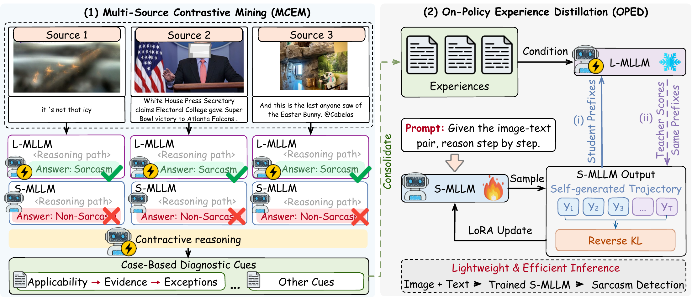

# PACE

Official code for **PACEing the Evolution: Generalizing Multimodal Sarcasm Detection via Transferable Experience and On-Policy Distillation**.



## Installation

Requires Linux, Python ≥ 3.10, and two CUDA GPUs (frozen teacher + trainable student).

```bash
python3 -m venv .venv && source .venv/bin/activate
bash setup.sh
```

Pinned versions are in [requirements.txt](requirements.txt) (PyTorch 2.11.0, vLLM 0.20.2, Transformers 5.16.1, Ray 2.58.0).

Place checkpoints under `models/` (or override with `PACE_TEACHER_MODEL` / `PACE_STUDENT_MODEL`):

```text
models/
├── Qwen3.5-9B/   # teacher
└── Qwen3.5-4B/   # student
```

## Datasets

| Dataset | Role | Download |
|---|---|---|
| MMSD2.0 | source | [text](https://github.com/JoeYing1019/MMSD2.0) · images from [MMSD](https://github.com/headacheboy/data-of-multimodal-sarcasm-detection) |
| DocMSU | source | [GitHub](https://github.com/fesvhtr/DocMSU) |
| SarcNet | source | [GitHub](https://github.com/yuetanbupt/SarcNet) |
| RedEval | OOD test only | [GitHub](https://github.com/TangBinghao/naacl2024) |

Arrange them as follows (paths set in [configs/pace_msd.yaml](configs/pace_msd.yaml)):

```text
datasets/
├── MMSD2.0/data/text_json_final/{train,test}.json
├── MMSD2.0/data/dataset_image/{image_id}.jpg
├── DocMSU/data/{train,test}.jsonl       # fields: sample_id, image_path, text, label
├── DocMSU/docmsu_all.json
├── sarcnet/data/{en,zh}/{train,test}.jsonl
├── RedEval/reddit_test.json
└── RedEval/images/{image_id}.jpg
```

Please follow each dataset's original license and access terms.

## Training

```bash
bash scripts/run_pace.sh            # full pipeline
bash scripts/run_pace.sh <stage>    # preflight | prepare | reason | extract | consolidate | train
```

The pipeline samples source data, generates blind teacher/student reasoning, extracts comparative experience, consolidates one experience pool per source pair, and trains the student with on-policy distillation. Select the source pair with `PACE_GROUP` (`mmsd2_docmsu` [default], `mmsd2_sarcnet`, `docmsu_sarcnet`); the held-out source and RedEval are never used for mining or training.

> **Note:** If extraction stops on pending teacher-correction reviews, add one JSON line per queued sample to `teacher_correction_reviews.jsonl` with `sample_id`, `correction_fingerprint`, `decision` (`ACCEPT`/`REVISE`), `revised_reasoning`, and `rationale`, then rerun.

## Evaluation

```bash
# Benchmark teacher/student on all datasets (results in evaluations/benchmarks/)
bash scripts/pace_benchmark.sh --devices 0,1 --datasets mmsd2 sarcnet docmsu redeval

# Evaluate a trained checkpoint on one file
bash scripts/pace_eval.sh --checkpoint <ckpt_dir> --data <test_file>
```

All stages are also available through `python3 tools/pace_cli.py --help`.

## Repository structure

```text
configs/   pipeline config and reasoning schema
prompts/   comparative reflection prompt
scripts/   pipeline, training, and evaluation launchers
tools/     CLI and data preparation
verl/      training runtime with PACE extensions
tests/     unit tests (python3 -m unittest discover -s tests)
```

## License

[MIT](LICENSE).
